```mermaid
%%{init: {
  "layout": "elk",
  "theme": "base",
  "themeVariables": {
    "background":          "#1d2021",
    "mainBkg":             "#3c3836",
    "nodeBorder":          "#504945",
    "lineColor":           "#a89984",
    "textColor":           "#ebdbb2",
    "primaryColor":        "#3c3836",
    "primaryBorderColor":  "#504945",
    "primaryTextColor":    "#ebdbb2",
    "secondaryColor":      "#282828",
    "tertiaryColor":       "#504945",
    "clusterBkg":          "#282828",
    "clusterBorder":       "#665c54"
  }
}}%%

flowchart LR

    subgraph MUS_GRP["musicians/  ·  143 files  +  _edges.json"]
        direction TB

        M["musicians/{id}.json
        ─────────────────────────────
        id            string · permanent key
        label         string · display name
        born / died   int | null
        era           trinity | bridge | golden_age |
                      disseminator | living_pillars | contemporary
        instrument    vocal | violin | veena | flute |
                      mridangam | ghatam | khanjira | …
        traditions    string[]  carnatic | hindustani
        bani          string | null  (stylistic school)
        sources       Source[]
        youtube       YouTubeEntry[]"]

        E["musicians/_edges.json  (bare array)
        ─────────────────────────────
        source       musician_id  ← guru
        target       musician_id  ← shishya
        confidence   float 0–1
        source_url   string
        note         string | null"]

        YT["YouTubeEntry  (embedded in musician.youtube[])
        ─────────────────────────────
        url            string
        label          string
        composition_id string | null  → compositions/
        raga_id        string | null  → ragas/
        year           int | null
        version        string | null
        performers     Performer[] | null
        kind           recital | lecdem | omit
        subjects       Subjects | null  (lecdem only)
          └ raga_ids[]         → ragas/
          └ composition_ids[]  → compositions/
          └ musician_ids[]     → musicians/"]
    end

    subgraph RAGA_GRP["ragas/  ·  156 files"]
        R["ragas/{id}.json
        ─────────────────────────────
        id            string · permanent key
        name          string · canonical name
        tradition     carnatic | hindustani
        aliases       string[]
        melakarta     int | null  (1–72; mela ragas only)
        is_melakarta  bool
        cakra         int | null  (1–12; mela ragas only)
        parent_raga   raga_id | null  (janya → parent mela)
        katapayadi    object | null
          └ madhyama, ri, ga, da, ni  (swara indices)
        sources       Source[]
        notes         string | null"]
    end

    subgraph COMP_GRP["compositions/  ·  221 files"]
        C["compositions/{id}.json
        ─────────────────────────────
        id           string · permanent key
        title        string
        composer_id  musician_id  (ADR-110: all composers
                     are musician nodes)
        raga_id      raga_id
        tala         adi | rupakam | misra_capu |
                     khanda_capu | tisra_triputa | …
        language     Telugu | Sanskrit | Tamil |
                     Kannada | Malayalam | Other | null
        sources      Source[]
        notes        string | null"]
    end

    subgraph REC_GRP["recordings/  ·  45+ files"]
        direction TB

        REC["recordings/{id}.json
        ─────────────────────────────
        id        string · permanent key
        video_id  string  (YouTube 11-char ID)
        url       string
        title     string
        date      string  (ISO 8601 or partial: 1965-01, 1967, 1960s)
        venue     string | null
        occasion  string | null
        sources   Source[]
        sessions  Session[]"]

        SESS["Session  (nested in recording.sessions[])
        ─────────────────────────────
        session_index  int  (1-based)
        performers     Performer[]
        performances   Performance[]"]

        PFMR["Performer  (shared shape: sessions + youtube)
        ─────────────────────────────
        musician_id    musician_id | null
        role           vocal | violin | veena | flute |
                       mridangam | ghatam | khanjira | …
        unmatched_name string | null  (when musician_id is null)"]

        PFMC["Performance  (nested in session.performances[])
        ─────────────────────────────
        performance_index  int  (1-based)
        timestamp          string  (HH:MM:SS)
        offset_seconds     int
        display_title      string
        composition_id     string | null  → compositions/
        raga_id            string | null  → ragas/
        tala               string | null  → talas.json
        composer_id        string | null  → musicians/
        notes              string | null
        type               tani | null  (percussion solo)
        version            string | null"]
    end

    subgraph LOOKUP_GRP["Lookup tables  (flat files)"]
        direction TB

        T["talas.json
        ─────────────────────────────
        talas[]:
          id           string  (adi, rupakam, misra_capu, …)
          label        string  (Unicode display form)
          searchTerms  string  (space-separated search aliases)"]

        TP["tanpura.json
        ─────────────────────────────
        []:  (bare array, no wrapper key)
          index        int
          id           string  (YouTube video ID)
          url          string
          title        string
          uploader     string
          duration     int  (seconds)
          upload_date  string  (YYYYMMDD)
          note         string  (pitch: C, C#, D, D#, E, …)"]
    end

    SRC["Source  (shared embedded shape)
    ─────────────────────────
    url    string
    label  string
    type   wikipedia | pdf | article | archive | other"]

    GJ[("graph.json
    ── DERIVED ARTIFACT ──
    Compiled by bani-render from
    all source files below.
    nodes[]  ·  edges[]  ·  recordings[]
    Never edit directly.
    Regenerate after every data change.")]

    %% ── Internal structure ───────────────────────────────────────────────

    M          -->|"has youtube[]"| YT
    REC        -->|"contains"| SESS
    SESS       -->|"contains"| PFMR
    SESS       -->|"contains"| PFMC

    %% ── Edge references (guru-shishya graph) ────────────────────────────

    E          -->|"source: guru"| M
    E          -->|"target: shishya"| M

    %% ── YouTubeEntry cross-references (recital) ─────────────────────────

    YT         -->|"composition_id"| C
    YT         -->|"raga_id"| R
    YT         -->|"performers[].musician_id"| M

    %% ── YouTubeEntry cross-references (lecdem, conditional) ─────────────

    YT         -.->|"lecdem: subjects.raga_ids"| R
    YT         -.->|"lecdem: subjects.composition_ids"| C
    YT         -.->|"lecdem: subjects.musician_ids"| M

    %% ── Composition cross-references ────────────────────────────────────

    C          -->|"composer_id"| M
    C          -->|"raga_id"| R

    %% ── Raga self-reference (janya → parent mela) ───────────────────────

    R          -->|"parent_raga\n(janya ragas only)"| R

    %% ── Recording / performance cross-references ─────────────────────────

    PFMR       -->|"musician_id"| M
    PFMC       -->|"composition_id"| C
    PFMC       -->|"raga_id"| R
    PFMC       -->|"composer_id"| M
    PFMC       -->|"tala"| T

    %% ── Shared Source embedded in every entity ───────────────────────────

    M          -.-|"embeds Source[]"| SRC
    R          -.-|"embeds Source[]"| SRC
    C          -.-|"embeds Source[]"| SRC
    REC        -.-|"embeds Source[]"| SRC

    %% ── bani-render compilation into graph.json ──────────────────────────

    M          ==>|"bani-render"| GJ
    E          ==>|"bani-render"| GJ
    R          ==>|"bani-render"| GJ
    C          ==>|"bani-render"| GJ
    REC        ==>|"bani-render"| GJ
    T          ==>|"bani-render"| GJ
    TP         ==>|"bani-render"| GJ

    %% ── Node styles (Gruvbox accent palette) ─────────────────────────────

    classDef musician   fill:#83a598,stroke:#504945,color:#1d2021
    classDef edge_file  fill:#83a598,stroke:#665c54,color:#1d2021,stroke-dasharray:4
    classDef youtube    fill:#83a598,stroke:#665c54,color:#1d2021,stroke-dasharray:4
    classDef raga       fill:#8ec07c,stroke:#504945,color:#1d2021
    classDef comp       fill:#d3869b,stroke:#504945,color:#1d2021
    classDef recording  fill:#fe8019,stroke:#504945,color:#1d2021
    classDef nested_rec fill:#fe8019,stroke:#665c54,color:#1d2021,stroke-dasharray:4
    classDef lookup     fill:#3c3836,stroke:#665c54,color:#ebdbb2
    classDef derived    fill:#fabd2f,stroke:#504945,color:#1d2021
    classDef shared_obj fill:#504945,stroke:#a89984,color:#ebdbb2

    class M musician
    class E edge_file
    class YT youtube
    class R raga
    class C comp
    class REC recording
    class SESS,PFMR,PFMC nested_rec
    class T,TP lookup
    class GJ derived
    class SRC shared_obj
```

# DIAGRAM-001 — Bani Flow Data Schema: Entity Files and Relationships

This diagram shows every JSON file type in the Bani Flow data layer, the fields each file contains, and the foreign-key references that connect them. It is addressed to the Librarian (understanding what to populate and validate), the Carnatic Coder (understanding what `bani-render` ingests), and the Graph Architect (reasoning about schema evolution and new association types). The `Source` shape (`url`, `label`, `type`) is an embedded object shared by every entity file; it is shown as a separate node to avoid duplication. `graph.json` is the compiled output artifact generated by `bani-render` from all source files — it is never edited directly.

Solid arrows (`-->`) indicate foreign-key references. Dashed arrows (`-.->`) indicate optional or conditional references (lecdem-only subjects). Thick arrows (`==>`) indicate the `bani-render` compilation flow into `graph.json`.

---

---

## Field reference tables

### Era vocabulary (musicians)

| value | description |
|---|---|
| `trinity` | Tyagaraja, Muthuswami Dikshitar, Shyama Shastri and contemporaries (~1750–1850) |
| `bridge` | Late 19th-century bridge generation |
| `golden_age` | ~1880–1940; institutionalisation of the concert format |
| `disseminator` | ~1920–1970; spread through recordings and sabha culture |
| `living_pillars` | Senior musicians still active or recently passed |
| `contemporary` | Currently active musicians |

### Cakra table (ragas — mela ragas only)

| cakra | name | mela numbers |
|---|---|---|
| 1 | Indu | 1–6 |
| 2 | Netra | 7–12 |
| 3 | Agni | 13–18 |
| 4 | Veda | 19–24 |
| 5 | Bana | 25–30 |
| 6 | Rutu | 31–36 |
| 7 | Rishi | 37–42 |
| 8 | Vasu | 43–48 |
| 9 | Brahma | 49–54 |
| 10 | Disi | 55–60 |
| 11 | Rudra | 61–66 |
| 12 | Aditya | 67–72 |

### Edge confidence scale

| range | meaning |
|---|---|
| 0.95–1.0 | Infobox statement or unambiguous primary source |
| 0.85–0.94 | Cross-confirmed across two or more sources |
| 0.70–0.84 | Single secondary source |
| < 0.70 | Speculative — must have a `note` field explaining the basis |

### Tala vocabulary (partial — full list in talas.json)

`adi` · `rupakam` · `misra_capu` · `khanda_capu` · `tisra_triputa` · `ata` · `dhruva` · `deshadi` · `jhampa` · `misra_jhampa`

### Performer role vocabulary

`vocal` · `violin` · `veena` · `flute` · `mridangam` · `ghatam` · `khanjira` · `tampura` · `tabla` (Hindustani) · `sitar` · `sarod` · `bansuri` · `sarangi`

### YouTubeEntry `kind` values

| value | meaning |
|---|---|
| omit / `recital` | Standard performance — uses `composition_id`, `raga_id` |
| `lecdem` | Lecture-demonstration — must use `subjects`; must NOT carry `composition_id` or `raga_id` directly |

---

## Key architectural notes

- **ADR-110**: `_composers.json` is retired. All composers are musician nodes. `composer_id` on both compositions and performances references `musicians/{id}.json` directly.
- **ADR-070**: The `Performer` shape (musician_id, role, unmatched_name) is shared between `recordings/*.json` sessions and `musician.youtube[].performers[]`.
- **ADR-077**: The `lecdem` kind on YouTube entries introduces `subjects` (raga_ids, composition_ids, musician_ids) instead of the direct `composition_id` / `raga_id` fields used by recitals.
- **ADR-114**: Hindustani musicians carry `traditions: ["hindustani"]`; cross-tradition musicians carry both. Hindustani-only musicians always have `bani: null`.
- **Render gate**: `graph.json` is a gitignored derived artifact. Run `bani-render` after every data change before querying via `cli.py` or viewing in the browser.
