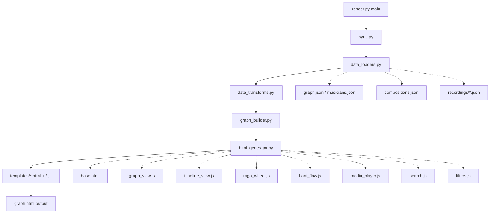

# ADR-024: Decompose carnatic/render.py into a render/ package

**Status:** Implemented
**Date:** 2026-04-12
**Implemented:** 2026-04-12
**Author:** Architect Mode

## Implementation Summary

All three phases completed on 2026-04-12. The monolithic `carnatic/render.py` (3,634 lines) has been decomposed into a `carnatic/render/` package.

### Actual structure delivered

```
carnatic/render/
├── __init__.py             # Public API re-exports (20 lines)
├── data_loaders.py         # yt_video_id, timestamp_to_seconds, load_compositions, load_recordings (58 lines)
├── data_transforms.py      # build_recording_lookups, build_composition_lookups (137 lines)
├── graph_builder.py        # 5 visual constants + build_elements (144 lines)
├── html_generator.py       # render_html() — loads templates, assembles HTML (92 lines)
├── sync.py                 # sync_graph_json() — ADR-016 sync logic (93 lines)
├── README.md               # Architecture documentation (495 lines)
└── templates/
    ├── base.html           # HTML skeleton + CSS (731 lines)
    ├── graph_view.js       # Cytoscape init + chip filters + tap handlers (521 lines)
    ├── media_player.js     # YouTube player + concert brackets (389 lines)
    ├── timeline_view.js    # Timeline layout + decade ruler (138 lines)
    ├── raga_wheel.js       # Three-view selector + raga wheel SVG (630 lines)
    ├── bani_flow.js        # Bani Flow filter + trail builder (538 lines)
    └── search.js           # Dropdown helper + musician/bani search (144 lines)
```

### Deviations from plan

- `filters.js` was **not created** as a separate file — chip filter logic (ERA/instrument chips) is tightly coupled to Cytoscape state and remained in `graph_view.js`
- `carnatic/render.py` orchestrator is **84 lines** (plan estimated 150)
- `html_generator.py` is **92 lines** (plan estimated 150) — template loading is simpler than anticipated
- Extraction was automated via `carnatic/_phase1_extract.py` and `carnatic/_phase2_extract.py` scripts

### Commits

- `570b912` — `render(toolchain): Phase 1 — extract Python modules into carnatic/render/ package`
- `1c6271d` — `render(toolchain): Phase 2 — extract JS/HTML templates into carnatic/render/templates/`
- `083fe06` — `tool(toolchain): Phase 3 — add carnatic/render/README.md architecture documentation`

### Success criteria verification

1. ✅ `python carnatic/render.py` produces `graph.html` (67 nodes, 48 edges)
2. ✅ All 50 existing tests pass (`python3 -m pytest carnatic/tests/ -q`)
3. ✅ No file exceeds 800 lines (largest: `base.html` at 731 lines)
4. ✅ Each module has a single, clear responsibility
5. ✅ `carnatic/render/README.md` documents the new architecture

## Problem Statement

[`carnatic/render.py`](../carnatic/render.py) has grown to **3,634 lines** and is monstrously difficult to debug, understand, and maintain—not just for humans but for LLMs too. It violates the single responsibility principle by mixing:

1. **Python data loading** (JSON parsing, file I/O)
2. **Data transformation** (building lookups, denormalization)
3. **Graph element construction** (Cytoscape.js nodes/edges)
4. **HTML template generation** (CSS, structure)
5. **JavaScript application logic** (~2,500 lines of embedded JS)
6. **Multiple UI subsystems** (graph view, timeline, raga wheel, bani flow, media player)

This monolithic structure makes it:
- Hard to locate bugs (which of 7 concerns is failing?)
- Difficult to test individual components
- Impossible to reuse logic (e.g., data loaders, JS modules)
- Challenging for LLMs to reason about (context window limitations)

## Goals

1. **Separation of Concerns**: Each file should have one clear responsibility
2. **Testability**: Pure functions that can be unit tested
3. **Reusability**: Data loaders and utilities usable by other tools
4. **Maintainability**: Easy to locate and fix bugs in specific subsystems
5. **LLM-Friendly**: Files small enough to fit in context windows with room for reasoning
6. **Backward Compatibility**: Existing `python carnatic/render.py` workflow must continue to work

## Proposed Architecture

### Directory Structure

```
carnatic/
├── render.py                    # Orchestrator (150 lines)
├── render/
│   ├── __init__.py             # Public API exports
│   ├── data_loaders.py         # JSON loading, file I/O (200 lines)
│   ├── data_transforms.py      # Lookups, denormalization (250 lines)
│   ├── graph_builder.py        # Cytoscape elements construction (200 lines)
│   ├── html_generator.py       # HTML template assembly (150 lines)
│   ├── sync.py                 # graph.json sync logic (100 lines)
│   └── templates/
│       ├── base.html           # HTML structure + CSS (400 lines)
│       ├── graph_view.js       # Cytoscape graph logic (600 lines)
│       ├── timeline_view.js    # Timeline layout + ruler (300 lines)
│       ├── raga_wheel.js       # Raga wheel SVG rendering (800 lines)
│       ├── bani_flow.js        # Bani Flow panel logic (500 lines)
│       ├── media_player.js     # Multi-window player (200 lines)
│       ├── search.js           # Musician + Bani search (200 lines)
│       └── filters.js          # Era/instrument chip filters (200 lines)
```

### Module Responsibilities

#### 1. [`carnatic/render.py`](../carnatic/render.py) — **Orchestrator** (150 lines)

**Purpose**: Entry point that coordinates the rendering pipeline.

**Responsibilities**:
- Parse command-line arguments (if any)
- Call sync, load, transform, build, generate in sequence
- Write output HTML file
- Print status messages

**Public API**:
```python
def main() -> None:
    """Render graph.html from data sources."""
```

**Dependencies**: All `render/*` modules

---

#### 2. `carnatic/render/data_loaders.py` — **Data Loading** (200 lines)

**Purpose**: Load JSON data from files with fallback logic.

**Responsibilities**:
- Load `graph.json` via `CarnaticGraph` API (ADR-013)
- Fallback to legacy `musicians.json` + `compositions.json`
- Load recordings from `recordings/` directory
- Handle missing files gracefully

**Public API**:
```python
def load_graph_data(graph_file: Path, data_file: Path, 
                    compositions_file: Path) -> tuple[dict, dict, dict]:
    """
    Load graph, compositions, and recordings data.
    
    Returns:
        (graph, comp_data, recordings_data)
        - graph: {"nodes": [...], "edges": [...]}
        - comp_data: {"ragas": [...], "composers": [...], "compositions": [...]}
        - recordings_data: {"recordings": [...]}
    """

def load_compositions(compositions_file: Path) -> dict:
    """Load compositions.json; return empty structure if absent."""

def load_recordings(recordings_dir: Path, recordings_file: Path) -> dict:
    """Load recordings from directory or legacy monolithic file."""

def yt_video_id(url: str) -> str | None:
    """Extract 11-char YouTube video ID from URL."""

def timestamp_to_seconds(ts: str) -> int:
    """Convert 'MM:SS' or 'HH:MM:SS' to integer seconds."""
```

**Dependencies**: `pathlib`, `json`, `re`, `carnatic.graph_api`

---

#### 3. `carnatic/render/data_transforms.py` — **Data Transformation** (250 lines)

**Purpose**: Build denormalized lookup tables for efficient rendering.

**Responsibilities**:
- Build `musician_to_performances` lookup
- Build `composition_to_performances` lookup
- Build `raga_to_performances` lookup
- Build `composition_to_nodes` lookup
- Build `raga_to_nodes` lookup

**Public API**:
```python
def build_recording_lookups(recordings_data: dict, comp_data: dict) -> tuple[dict, dict, dict]:
    """
    Build three denormalized lookup dicts from recordings.
    
    Returns:
        (musician_to_performances, composition_to_performances, raga_to_performances)
    """

def build_composition_lookups(graph: dict, comp_data: dict, 
                               recordings_data: dict) -> tuple[dict, dict]:
    """
    Build composition/raga → musician node ID lookups.
    
    Returns:
        (composition_to_nodes, raga_to_nodes)
    """
```

**Dependencies**: `collections.defaultdict`

---

#### 4. `carnatic/render/graph_builder.py` — **Graph Element Construction** (200 lines)

**Purpose**: Transform graph data into Cytoscape.js elements.

**Responsibilities**:
- Calculate node degrees for sizing
- Map eras to colors, instruments to shapes
- Build node elements with all metadata
- Build edge elements with confidence styling
- Apply visual mappings (size, color, shape, font)

**Public API**:
```python
def build_elements(graph: dict) -> list[dict]:
    """
    Build Cytoscape.js elements from graph data.
    
    Returns:
        List of element dicts with {"data": {...}} structure
    """
```

**Dependencies**: `collections.defaultdict`, `data_loaders.yt_video_id`

**Constants** (moved from render.py):
```python
ERA_COLORS: dict[str, str]
ERA_LABELS: dict[str, str]
INSTRUMENT_SHAPES: dict[str, str]
NODE_SIZES: dict[str, int]
ERA_FONT_SIZES: dict[str, int]
```

---

#### 5. `carnatic/render/html_generator.py` — **HTML Assembly** (150 lines)

**Purpose**: Assemble final HTML from templates and data.

**Responsibilities**:
- Load HTML/CSS/JS templates from `templates/`
- Inject JSON data into JavaScript
- Combine all pieces into final HTML string
- Handle template variable substitution

**Public API**:
```python
def render_html(
    elements: list[dict],
    graph: dict,
    comp_data: dict,
    composition_to_nodes: dict,
    raga_to_nodes: dict,
    recordings_data: dict,
    musician_to_performances: dict,
    composition_to_performances: dict,
    raga_to_performances: dict,
) -> str:
    """
    Render complete HTML page from templates and data.
    
    Returns:
        Complete HTML string ready to write to file
    """
```

**Dependencies**: `pathlib`, `json`, template files

---

#### 6. `carnatic/render/sync.py` — **Graph Sync** (100 lines)

**Purpose**: Sync `graph.json` from source files (ADR-016).

**Responsibilities**:
- Sync `graph.json["musicians"]` from `musicians.json`
- Sync `graph.json["compositions"]` from `compositions.json`
- Rebuild `graph.json["recording_refs"]` from `recordings/` directory
- Atomic write via temp file

**Public API**:
```python
def sync_graph_json(
    graph_file: Path,
    musicians_file: Path,
    compositions_file: Path,
) -> None:
    """
    Sync graph.json from canonical source files.
    
    Idempotent: safe to call on every render.
    Atomic: writes via temp file + os.replace.
    """
```

**Dependencies**: `pathlib`, `json`, `os`, `tempfile`

---

#### 7. `carnatic/render/templates/base.html` — **HTML Structure + CSS** (400 lines)

**Purpose**: HTML skeleton and all CSS styling.

**Contents**:
- `<!DOCTYPE html>` structure
- All CSS (Gruvbox theme, layout, components)
- Placeholder comments for JavaScript injection: `<!-- INJECT: graph_view.js -->`
- Template variables: `{node_count}`, `{edge_count}`, `{elements_json}`, etc.

**No JavaScript** — all JS moved to separate `.js` files.

---

#### 8. `carnatic/render/templates/graph_view.js` — **Graph View Logic** (600 lines)

**Purpose**: Cytoscape.js initialization and graph-specific interactions.

**Contents**:
- Cytoscape initialization with layout config
- Node/edge styling
- Zoom-tiered label visibility
- Hover popover
- Node/edge selection handlers
- Background tap handler
- Label toggle, relayout, fit/reset controls
- Era/instrument filter chips

**Exports** (via global scope):
```javascript
const cy;  // Cytoscape instance
function selectNode(node);
function applyZoomLabels();
function relayout();
function toggleLabels();
```

---

#### 9. `carnatic/render/templates/timeline_view.js` — **Timeline Layout** (300 lines)

**Purpose**: Timeline view layout and decade ruler rendering.

**Contents**:
- Timeline layout algorithm (era lanes, born-year positioning)
- Decade ruler SVG rendering
- Pan/zoom ruler updates
- View switching logic (graph ↔ timeline)

**Exports**:
```javascript
function applyTimelineLayout();
function showTimelineRuler();
function hideTimelineRuler();
```

---

#### 10. `carnatic/render/templates/raga_wheel.js` — **Raga Wheel** (800 lines)

**Purpose**: Melakarta raga wheel SVG rendering (ADR-023).

**Contents**:
- Raga wheel SVG generation
- Cakra sectors, mela nodes, janya satellites
- Composition/musician expansion
- Pan/zoom/double-click-reset
- Tooltip rendering
- Click handlers for drill-down

**Exports**:
```javascript
function drawRagaWheel();
function showRagaWheel();
function hideRagaWheel();
```

---

#### 11. `carnatic/render/templates/bani_flow.js` — **Bani Flow Panel** (500 lines)

**Purpose**: Bani Flow composition/raga filtering and listening trail.

**Contents**:
- Bani filter application (highlight nodes/edges)
- Listening trail construction (ADR-018, ADR-019, ADR-020)
- Trail filtering
- Subject header rendering (raga/composition metadata)
- Janyas panel (ADR-022)
- Co-performer display (ADR-019)

**Exports**:
```javascript
function applyBaniFilter(type, id);
function buildListeningTrail(type, id, matchedNodeIds);
function clearBaniFilter();
function triggerBaniSearch(type, id);
```

---

#### 12. `carnatic/render/templates/media_player.js` — **Media Player** (200 lines)

**Purpose**: Multi-window floating YouTube player (ADR-012).

**Contents**:
- Player registry (vid → player instance)
- Player creation, drag, resize
- `openOrFocusPlayer()` logic
- Playing indicator refresh
- Concert bracket toggle (ADR-018)

**Exports**:
```javascript
const playerRegistry;
function openOrFocusPlayer(vid, label, artistName, startSeconds);
function refreshPlayingIndicators();
```

---

#### 13. `carnatic/render/templates/search.js` — **Search Boxes** (200 lines)

**Purpose**: Musician search and Bani Flow search dropdowns.

**Contents**:
- Shared dropdown helper (`makeDropdown`)
- Musician search implementation
- Bani Flow search implementation (ragas + compositions)
- Keyboard navigation (arrow keys, enter, escape)

**Exports**:
```javascript
// (IIFEs, no explicit exports — self-contained)
```

---

#### 14. `carnatic/render/templates/filters.js` — **Filter Chips** (200 lines)

**Purpose**: Era and instrument filter chips in top bar (ADR-008).

**Contents**:
- Filter chip construction
- Chip toggle logic
- Mutual exclusion with Bani Flow filter
- Scope label updates

**Exports**:
```javascript
function buildFilterChips();
function toggleFilterChip(chip);
function applyChipFilters();
function clearAllChipFilters();
```

---

## Data Flow Diagram



## Migration Strategy

### Phase 1: Extract Python Modules (Low Risk)

**Goal**: Move Python logic to separate modules without touching JavaScript.

**Steps**:
1. Create `carnatic/render/` directory
2. Extract `sync.py` (lines 3495-3578)
3. Extract `data_loaders.py` (lines 76-113 + helpers)
4. Extract `data_transforms.py` (lines 124-255)
5. Extract `graph_builder.py` (lines 259-344 + constants)
6. Update `render.py` to import and call these modules
7. **Test**: `python carnatic/render.py` should produce identical `graph.html`

**Risk**: Low — pure Python refactoring, no JS changes

---

### Phase 2: Extract JavaScript to Separate Files (Medium Risk)

**Goal**: Move embedded JavaScript to `.js` files for maintainability.

**Steps**:
1. Create `carnatic/render/templates/` directory
2. Extract `base.html` (HTML + CSS only, lines 385-1113)
3. Extract `graph_view.js` (Cytoscape init + graph interactions)
4. Extract `timeline_view.js` (timeline layout + ruler)
5. Extract `raga_wheel.js` (raga wheel IIFE)
6. Extract `bani_flow.js` (Bani Flow logic)
7. Extract `media_player.js` (player management)
8. Extract `search.js` (search dropdowns)
9. Extract `filters.js` (filter chips)
10. Update `html_generator.py` to load and inject these files
11. **Test**: Visual regression testing — all UI features must work identically

**Risk**: Medium — JavaScript extraction requires careful dependency management

---

### Phase 3: Refine and Document (Low Risk)

**Goal**: Polish the new structure and add documentation.

**Steps**:
1. Add docstrings to all public functions
2. Create `carnatic/render/README.md` explaining architecture
3. Add type hints to Python modules
4. Create unit tests for pure functions (data loaders, transforms)
5. Update main `README.md` with new structure

**Risk**: Low — documentation and testing improvements

---

## Testing Strategy

### Unit Tests (New)

```python
# carnatic/tests/test_render_data_loaders.py
def test_yt_video_id_extraction():
    assert yt_video_id("https://youtu.be/abc123def45") == "abc123def45"
    assert yt_video_id("https://www.youtube.com/watch?v=abc123def45") == "abc123def45"

def test_timestamp_to_seconds():
    assert timestamp_to_seconds("1:30") == 90
    assert timestamp_to_seconds("1:05:30") == 3930
```

### Integration Tests (Existing)

- `carnatic/tests/test_graph_topology.py` — already tests graph structure
- `carnatic/tests/test_schema_integrity.py` — already validates data schemas

### Visual Regression Tests (Manual)

**Checklist** after Phase 2:
- [ ] Graph view renders correctly
- [ ] Timeline view renders correctly
- [ ] Raga wheel renders correctly
- [ ] Bani Flow filtering works
- [ ] Media player opens/closes
- [ ] Search boxes work
- [ ] Filter chips work
- [ ] All ADR features intact (ADR-012, ADR-018, ADR-019, ADR-020, ADR-022, ADR-023)

---

## Benefits

### For Humans

1. **Easier Debugging**: Bug in timeline? Look in `timeline_view.js` (300 lines) not `render.py` (3,634 lines)
2. **Faster Onboarding**: New contributors can understand one module at a time
3. **Parallel Development**: Multiple people can work on different modules without conflicts
4. **Reusability**: Data loaders can be used by CLI tools, tests, other scripts

### For LLMs

1. **Context Window Efficiency**: Each file fits comfortably in context with room for reasoning
2. **Focused Analysis**: LLM can load only relevant modules for a given task
3. **Better Code Generation**: Smaller, focused files → more accurate suggestions
4. **Easier Debugging**: LLM can reason about 200-line modules vs. 3,600-line monolith

### For the Project

1. **Maintainability**: Clear separation of concerns
2. **Testability**: Pure functions can be unit tested
3. **Extensibility**: Easy to add new views (e.g., "Composer Network" view)
4. **Performance**: No change (same output HTML)

---

## Risks and Mitigations

| Risk | Likelihood | Impact | Mitigation |
|------|------------|--------|------------|
| JavaScript dependency bugs | Medium | High | Careful extraction, preserve global scope, test thoroughly |
| Template injection errors | Low | Medium | Use simple string replacement, validate output |
| Import path issues | Low | Low | Use relative imports, test in clean environment |
| Breaking existing workflows | Low | High | Keep `python carnatic/render.py` working, add tests |

---

## Open Questions

1. **Should we use a proper templating engine** (Jinja2) instead of string replacement?
   - **Pro**: More robust, better error messages
   - **Con**: Adds dependency, overkill for single template
   - **Decision**: Start with string replacement, migrate to Jinja2 if complexity grows

2. **Should JavaScript modules use ES6 modules** (`import`/`export`)?
   - **Pro**: Modern, better dependency management
   - **Con**: Requires build step or `<script type="module">`
   - **Decision**: Keep global scope for now (no build step), consider ES6 in future

3. **Should we split `base.html` into smaller templates**?
   - **Pro**: Even more modular (header, sidebar, canvas)
   - **Con**: More files to manage
   - **Decision**: Start with single `base.html`, split if it grows beyond 500 lines

---

## Success Criteria

1. ✅ `python carnatic/render.py` produces byte-identical `graph.html` (or functionally identical)
2. ✅ All existing tests pass
3. ✅ No file exceeds 800 lines
4. ✅ Each module has a single, clear responsibility
5. ✅ Documentation explains the new architecture
6. ✅ Visual regression checklist passes

---

## Timeline Estimate

**Phase 1** (Python extraction): 1-2 days  
**Phase 2** (JavaScript extraction): 2-3 days  
**Phase 3** (Documentation + tests): 1 day  

**Total**: 4-6 days of focused work

---

## Next Steps

1. **Review this plan** with the team
2. **Get approval** to proceed
3. **Create a feature branch**: `refactor/render-modularization`
4. **Execute Phase 1** (Python modules)
5. **Test and validate** before proceeding to Phase 2

---

## References

- [ADR-012: Same-concert track switching](ADR-012-same-concert-track-switching.md)
- [ADR-013: Single source of truth traversal layer](ADR-013-single-source-of-truth-traversal-layer.md)
- [ADR-016: Writer validation source of truth](ADR-016-writer-validation-source-of-truth.md)
- [ADR-018: Concert-bracketed recording groups](ADR-018-concert-bracketed-recording-groups.md)
- [ADR-019: Co-performer bracketed trail entries](ADR-019-co-performer-bracketed-trail-entries.md)
- [ADR-020: Raga composition header parity](ADR-020-raga-composition-header-parity.md)
- [ADR-022: Raga panel navigability](ADR-022-raga-panel-navigability.md)
- [ADR-023: Raga wheel third view](ADR-023-raga-wheel-third-view.md)
