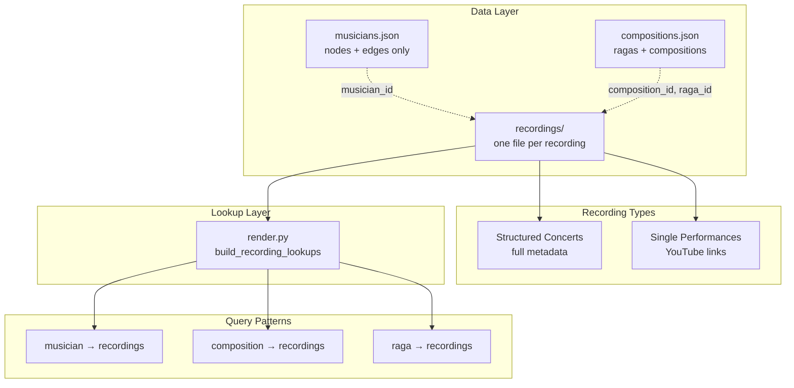

# Unified Recordings Architecture

## Problem Statement

Currently, recording data exists in **two separate locations** with different schemas:

1. **`musicians.json` → `youtube[]` arrays** — Simple YouTube links attached to individual musicians
   - Schema: `{url, label, composition_id?, raga_id?, year?}`
   - Used for: Bani Flow listening trail, musician profile recordings
   - **Scaling issue**: As we add more recordings with strict tagging (raga, composition), this array grows unbounded within the monolithic `musicians.json` file

2. **`recordings/` directory** — Structured concert recordings with full metadata
   - Schema: Full recording object with sessions, performers, performances, timestamps
   - Used for: Structured concert playback, performance indexing
   - **Scaling solution**: Already decomposed into one file per recording

### The Core Problem

**Duplication and fragmentation:**
- A YouTube video of TM Krishna singing "Gitarthamu" could appear in:
  - `musicians.json` → `tm_krishna.youtube[]` as a simple link
  - `recordings/music_academy_2019_tmk.json` as a structured performance within a concert
- No single source of truth for "all recordings"
- No way to cross-reference between the two systems
- `musicians.json` will grow unbounded as we add more tagged recordings

---

## Proposed Solution: Unified Recording References

### Architecture Overview



### Key Design Decisions

#### 1. **Remove `youtube[]` from `musicians.json`**

**Current:**
```json
{
  "id": "tm_krishna",
  "label": "TM Krishna",
  "youtube": [
    {
      "url": "https://youtu.be/BIEzjDD3pvA",
      "label": "maakElaraa vicāramu · Ravichandrika · Deshadi",
      "composition_id": "maakelara_vicaaramu",
      "raga_id": "ravichandrika"
    }
  ]
}
```

**Proposed:**
```json
{
  "id": "tm_krishna",
  "label": "TM Krishna"
}
```

All recording data moves to `recordings/`.

#### 2. **Extend `recordings/` to support single-performance recordings**

**New recording type: "single performance"**

For standalone YouTube links (not part of a structured concert), create minimal recording files:

```json
{
  "id": "tmk_maakelara_ravichandrika",
  "video_id": "BIEzjDD3pvA",
  "url": "https://youtu.be/BIEzjDD3pvA",
  "title": "maakElaraa vicāramu · Ravichandrika · Deshadi - TM Krishna",
  "date": null,
  "venue": null,
  "occasion": null,
  "sources": [
    {
      "url": "https://youtu.be/BIEzjDD3pvA",
      "label": "YouTube",
      "type": "other"
    }
  ],
  "sessions": [
    {
      "session_index": 1,
      "performers": [
        {
          "musician_id": "tm_krishna",
          "role": "vocal"
        }
      ],
      "performances": [
        {
          "performance_index": 1,
          "timestamp": "00:00",
          "offset_seconds": 0,
          "composition_id": "maakelara_vicaaramu",
          "raga_id": "ravichandrika",
          "tala": "deshadi",
          "composer_id": "tyagaraja",
          "display_title": "maakElaraa vicāramu",
          "notes": null
        }
      ]
    }
  ]
}
```

**Benefits:**
- Unified schema for all recordings
- Single source of truth
- Scales horizontally (one file per recording)
- Supports both simple and complex recordings

#### 3. **Maintain backward compatibility in render pipeline**

The existing lookup functions already work:
- [`build_recording_lookups()`](carnatic/render.py:119) builds `musician_to_performances`, `composition_to_performances`, `raga_to_performances`
- [`build_composition_lookups()`](carnatic/render.py:191) currently reads from `musicians.json` → `youtube[]`

**Migration path:**
1. Keep `build_composition_lookups()` reading from `musicians.json` → `youtube[]` (legacy)
2. Extend `build_recording_lookups()` to also populate the same lookup dicts
3. After migration, remove `youtube[]` support from `build_composition_lookups()`

---

## Schema Extensions

### Recording Type Field (Optional)

Add optional `type` field to top-level recording object:

```json
{
  "id": "...",
  "type": "concert",  // or "single_performance"
  ...
}
```

- `"concert"` — Multi-session structured concert (default if omitted)
- `"single_performance"` — Single YouTube link, one session, one performance

This is **optional metadata** for human readability; the schema is identical.

### Performer Role Extensions

Already supported in current schema:
- `vocal`, `violin`, `veena`, `flute`, `mridangam`, `ghatam`, `tampura`, `bharatanatyam`

No changes needed.

---

## Migration Strategy

### Phase 1: Extend `recordings/` schema (already done ✓)

The current schema already supports single-performance recordings. No schema changes needed.

### Phase 2: Migrate `musicians.json` → `youtube[]` to `recordings/`

**Migration script: `carnatic/migrate_youtube_to_recordings.py`**

For each musician with `youtube[]` entries:
1. For each YouTube entry:
   - Generate recording `id`: `{musician_id}_{composition_id or video_id}`
   - Create `recordings/{id}.json` with single session, single performance
   - Preserve all metadata: `composition_id`, `raga_id`, `year`, `label`
2. Remove `youtube[]` from musician node
3. Log each migration: `[YOUTUBE→RECORDING] {musician_id} → {recording_id}`

**Dry-run mode:** `--dry-run` flag to preview changes without writing files.

### Phase 3: Update render pipeline

**Modify [`build_composition_lookups()`](carnatic/render.py:191):**

Currently reads from `musicians.json` → `youtube[]`. After migration, this becomes a no-op (or is removed entirely).

**Extend [`build_recording_lookups()`](carnatic/render.py:119):**

Already builds the correct lookup dicts from `recordings/`. No changes needed — it will automatically pick up the migrated recordings.

### Phase 4: Update documentation

- [`carnatic/data/READYOU.md`](carnatic/data/READYOU.md) — Remove Workflow A (YouTube to musicians.json)
- [`carnatic/data/recordings/READYOU.md`](carnatic/data/recordings/READYOU.md) — Add workflow for single-performance recordings
- [`.roomodes`](.roomodes) — Update Librarian mode instructions

---

## Lookup Patterns (Post-Migration)

### Query: "All recordings by musician X"

```python
musician_to_performances[musician_id]
# Returns: [PerformanceRef, ...]
# Each ref: {recording_id, video_id, session_index, performance_index, ...}
```

### Query: "All recordings of composition Y"

```python
composition_to_performances[composition_id]
# Returns: [PerformanceRef, ...]
```

### Query: "All recordings in raga Z"

```python
raga_to_performances[raga_id]
# Returns: [PerformanceRef, ...]
```

### Query: "All recordings" (single source of truth)

```python
recordings_dir = Path("carnatic/data/recordings")
all_recordings = [
    json.loads(f.read_text())
    for f in sorted(recordings_dir.glob("*.json"))
    if not f.name.startswith("_")
]
```

---

## File Naming Convention

### Structured concerts (existing)

```
{event}_{year}_{primary_artist}.json
```

Examples:
- `poonamallee_1965.json`
- `music_academy_1972_semmangudi.json`
- `wesleyan_1967_ramnad_krishnan.json`

### Single performances (new)

```
{musician_id}_{composition_id}_{video_id_suffix}.json
```

Examples:
- `tmk_maakelara_ravichandrika.json`
- `semmangudi_maakelara_ravichandrika.json`
- `gnb_air_1960.json` (if no composition_id, use descriptive label)

**Collision handling:**
If a musician has multiple recordings of the same composition, append video ID suffix:
- `tmk_gitarthamu_younger.json`
- `tmk_gitarthamu_older.json`

Or use video_id directly:
- `tmk_gitarthamu_-_6zvmxD1b4.json`

---

## Benefits of Unified Architecture

### 1. **Single source of truth**
- All recordings in `recordings/`
- No duplication between `musicians.json` and `recordings/`

### 2. **Horizontal scaling**
- `musicians.json` stays small (nodes + edges only)
- Each recording is a separate file
- Adding 1000 recordings = 1000 small files, not one giant file

### 3. **Consistent schema**
- Same structure for simple and complex recordings
- Same tagging conventions (composition_id, raga_id, etc.)
- Same performer attribution model

### 4. **Better queryability**
- Lookup by musician, composition, raga all work the same way
- No need to check two different data sources
- Easier to build advanced queries (e.g., "all recordings of raga X by musicians in era Y")

### 5. **LLM-friendly workflow**
- One file per recording = one LLM output
- No risk of corrupting unrelated data
- Clear change log per recording

### 6. **Backward compatible**
- Existing `recordings/` files unchanged
- Render pipeline already supports the unified model
- Migration is additive (no breaking changes during transition)

---

## Open Questions

### Q1: Should we keep `youtube[]` in `musicians.json` during transition?

**Option A: Hard cutover**
- Migrate all at once
- Remove `youtube[]` support from render pipeline
- Clean break

**Option B: Gradual migration**
- Keep `youtube[]` support in render pipeline
- Migrate incrementally
- Remove `youtube[]` support after all data migrated

**Recommendation: Option B** — Less risky, allows validation before full cutover.

### Q2: How to handle recordings with multiple primary artists?

**Current approach in structured concerts:**
- Filename uses primary artist: `poonamallee_1965.json`
- All performers listed in `sessions[].performers[]`

**For single performances:**
- If multiple artists, use first artist in filename
- All artists listed in `performers[]`
- Lookup system handles multi-artist queries via `musician_to_performances`

**Example:**
```
alathur_brothers_jagadananda_nata.json
```

```json
{
  "performers": [
    {"musician_id": "alathur_brothers", "role": "vocal"}
  ]
}
```

### Q3: Should we add a reverse index file?

**Proposal: `recordings/_index.json`**

```json
{
  "musician_to_recordings": {
    "tm_krishna": ["tmk_maakelara_ravichandrika", "music_academy_2019_tmk", ...]
  },
  "composition_to_recordings": {
    "maakelara_vicaaramu": ["tmk_maakelara_ravichandrika", "semmangudi_maakelara_ravichandrika", ...]
  },
  "raga_to_recordings": {
    "ravichandrika": [...]
  }
}
```

**Benefits:**
- Fast lookups without scanning all files
- Pre-computed index for web UI

**Drawbacks:**
- Must be regenerated after every recording change
- Adds complexity

**Recommendation: Not needed initially** — `render.py` already builds these lookups at compile time. Add later if query performance becomes an issue.

---

## Implementation Checklist

### Phase 1: Schema validation ✓
- [x] Current schema supports single-performance recordings
- [x] No breaking changes needed

### Phase 2: Migration tooling
- [ ] Write `carnatic/migrate_youtube_to_recordings.py`
- [ ] Add `--dry-run` flag
- [ ] Add collision detection (duplicate video_id)
- [ ] Add validation (all musician_id, composition_id, raga_id exist)

### Phase 3: Execute migration
- [ ] Run migration script with `--dry-run`
- [ ] Review generated files
- [ ] Run migration script (write files)
- [ ] Run `python3 carnatic/render.py` to verify
- [ ] Commit migrated recordings
- [ ] Remove `youtube[]` from `musicians.json`

### Phase 4: Update render pipeline
- [ ] Modify `build_composition_lookups()` to skip `youtube[]` (or remove entirely)
- [ ] Verify all lookups still work
- [ ] Update tests (if any)

### Phase 5: Documentation
- [ ] Update `carnatic/data/READYOU.md` — remove Workflow A
- [ ] Update `carnatic/data/recordings/READYOU.md` — add single-performance workflow
- [ ] Update `.roomodes` — Librarian mode instructions
- [ ] Update `carnatic/README.md` — architecture overview

### Phase 6: Cleanup
- [ ] Remove legacy `recordings.json.bak`
- [ ] Archive migration script (or keep for reference)
- [ ] Final commit: "Unified recordings architecture complete"

---

## Timeline

**No time estimates provided** — focus on clear, actionable steps.

---

## Conclusion

The unified recordings architecture solves the scaling problem by:

1. **Decomposing `musicians.json`** — Remove unbounded `youtube[]` arrays
2. **Extending `recordings/`** — Support both structured concerts and single performances
3. **Maintaining backward compatibility** — Gradual migration, no breaking changes
4. **Providing a single source of truth** — All recordings in one place

The migration is **low-risk** because:
- The schema already supports the unified model
- The render pipeline already builds the correct lookups
- We can validate incrementally with `--dry-run`

Next step: **Implement the migration script** and execute Phase 2.
