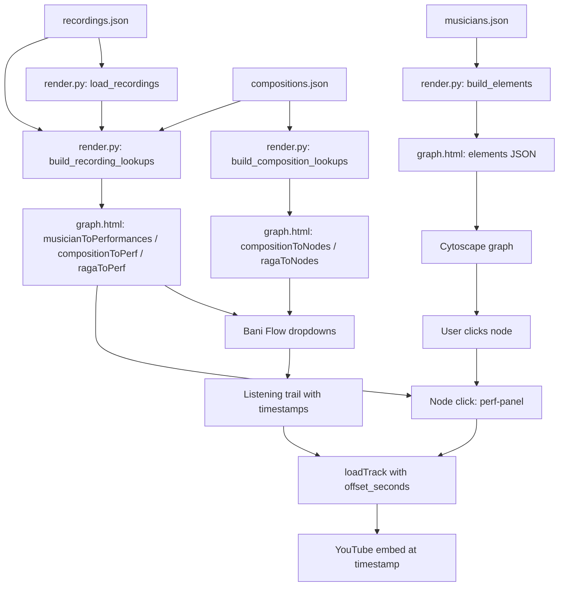

# YouTube Recording Integration — Architectural Plan

**Project:** Carnatic Guru-Shishya Knowledge Graph  
**Scope:** Timestamp-aware performance linking from a new `recordings.json` data file through `render.py` into `graph.html`  
**Status:** Plan only — no code changes made

---

## 1. Motivation and Design Principles

The existing `musicians.json` `youtube[]` array stores one recording per entry, keyed to a single musician node. This works for solo recitals but breaks down for concert recordings where:

- A single YouTube video contains **many performances** (different compositions, ragas, talas)
- Each performance has a **timestamp offset** within the video
- Multiple **musicians** participate in each session (vocalist, violinist, mridangist)
- The same video is relevant to **multiple graph nodes** simultaneously

The new design introduces a standalone `recordings.json` file that models concerts as structured events, with sessions and per-performance timestamps. The existing `musicians.json` `youtube[]` array is **not replaced** — it continues to hold simple per-musician recordings. `recordings.json` is an additive layer for structured concert data.

---

## 2. Proposed `recordings.json` Schema

### 2.1 Top-level structure

```json
{
  "recordings": [ /* array of Recording objects */ ]
}
```

### 2.2 Recording object

```json
{
  "id":          "poonamallee_1965",
  "video_id":    "_rj8fHJiSLA",
  "url":         "https://youtu.be/_rj8fHJiSLA?si=5KXu4oFMN1VlTU-v",
  "title":       "Poonamallee Concert 1965",
  "date":        "1965",
  "venue":       "Poonamallee",
  "occasion":    null,
  "sources": [
    {"url": "https://youtu.be/_rj8fHJiSLA", "label": "YouTube", "type": "other"}
  ],
  "sessions":    [ /* array of Session objects */ ]
}
```

| field | type | notes |
|---|---|---|
| `id` | string | snake_case, permanent once set |
| `video_id` | string | 11-character YouTube video ID |
| `url` | string | canonical YouTube URL (any form) |
| `title` | string | human-readable event title |
| `date` | string | year, or ISO date if known (`"1965"`, `"1965-12-25"`) |
| `venue` | string \| null | venue name |
| `occasion` | string \| null | festival, sabha, or occasion name |
| `sources` | array | source objects (same schema as musicians.json) |
| `sessions` | array | ordered list of Session objects |

### 2.3 Session object

```json
{
  "session_index": 1,
  "performers": [
    {"musician_id": "semmangudi_srinivasa_iyer", "role": "vocal"},
    {"musician_id": "lalgudi_jayaraman",          "role": "violin"},
    {"musician_id": "palghat_mani_iyer",          "role": "mridangam"}
  ],
  "performances": [ /* array of Performance objects */ ]
}
```

| field | type | notes |
|---|---|---|
| `session_index` | int | 1-based position within the concert |
| `performers` | array | list of Performer objects |
| `performances` | array | ordered list of Performance objects within this session |

### 2.4 Performer object

```json
{"musician_id": "semmangudi_srinivasa_iyer", "role": "vocal"}
```

| field | type | notes |
|---|---|---|
| `musician_id` | string | references `musicians.json` `nodes[].id`; `null` if unmatched |
| `role` | string | instrument role in this session: `vocal`, `violin`, `mridangam`, `veena`, `flute`, `ghatam`, `kanjira`, `morsing`, `tanpura` |
| `unmatched_name` | string \| null | raw name string when `musician_id` is null — never silently dropped |

### 2.5 Performance object

```json
{
  "performance_index": 1,
  "timestamp":         "00:00",
  "offset_seconds":    0,
  "composition_id":    "bale_balend_bhushani",
  "raga_id":           "ritigaula",
  "tala":              "adi",
  "composer_id":       "tyagaraja",
  "display_title":     "bālē bālēndu bhūṣaṇi",
  "notes":             null
}
```

| field | type | notes |
|---|---|---|
| `performance_index` | int | 1-based position within the session |
| `timestamp` | string | human-readable timestamp as it appears in the source (`"00:00"`, `"31:55"`, `"02:15:49"`) |
| `offset_seconds` | int | pre-computed seconds offset for YouTube `?t=` parameter |
| `composition_id` | string \| null | references `compositions.json` `compositions[].id` |
| `raga_id` | string \| null | references `compositions.json` `ragas[].id` |
| `tala` | string \| null | tala name (free text, consistent with compositions.json convention) |
| `composer_id` | string \| null | references `compositions.json` `composers[].id` |
| `display_title` | string | title exactly as given in the source metadata (may use diacritics, transliteration) |
| `notes` | string \| null | free-text note (e.g. `"ragam tanam pallavi"`, `"mangalam"`) |

**Key design decision:** `offset_seconds` is stored pre-computed alongside the human-readable `timestamp` string. This avoids runtime parsing in the browser and makes the data self-documenting. The conversion is done once in Python at data-entry time (see §4).

---

## 3. Sample Data — 1965 Poonamallee Concert

```json
{
  "recordings": [
    {
      "id":       "poonamallee_1965",
      "video_id": "_rj8fHJiSLA",
      "url":      "https://youtu.be/_rj8fHJiSLA?si=5KXu4oFMN1VlTU-v",
      "title":    "Poonamallee Concert 1965",
      "date":     "1965",
      "venue":    "Poonamallee",
      "occasion": null,
      "sources": [
        {"url": "https://youtu.be/_rj8fHJiSLA", "label": "YouTube", "type": "other"}
      ],
      "sessions": [
        {
          "session_index": 1,
          "performers": [
            {"musician_id": null, "role": "vocal", "unmatched_name": "SESSION 1 VOCALIST"},
            {"musician_id": null, "role": "violin", "unmatched_name": "SESSION 1 VIOLINIST"}
          ],
          "performances": [
            {
              "performance_index": 1,
              "timestamp":      "00:00",
              "offset_seconds": 0,
              "composition_id": "bale_balend_bhushani",
              "raga_id":        "ritigaula",
              "tala":           "adi",
              "composer_id":    "tyagaraja",
              "display_title":  "bālē bālēndu bhūṣaṇi",
              "notes":          null
            }
          ]
        },
        {
          "session_index": 2,
          "performers": [
            {"musician_id": null, "role": "vocal", "unmatched_name": "SESSION 2 VOCALIST"}
          ],
          "performances": [
            {
              "performance_index": 1,
              "timestamp":      "31:55",
              "offset_seconds": 1915,
              "composition_id": "enduku_peddala",
              "raga_id":        "shankarabharanam",
              "tala":           "adi",
              "composer_id":    "tyagaraja",
              "display_title":  "enduku peddala",
              "notes":          null
            }
          ]
        },
        {
          "session_index": 5,
          "performers": [
            {"musician_id": null, "role": "vocal", "unmatched_name": "SESSION 5 VOCALIST"}
          ],
          "performances": [
            {
              "performance_index": 1,
              "timestamp":      "02:15:49",
              "offset_seconds": 8149,
              "composition_id": "koluvamaregada",
              "raga_id":        "todi",
              "tala":           "adi",
              "composer_id":    "tyagaraja",
              "display_title":  "koluvamaregadā",
              "notes":          null
            }
          ]
        }
      ]
    }
  ]
}
```

> **Note:** `musician_id: null` with `unmatched_name` is used for performers not yet matched to graph nodes. This follows the same `[FLAG]` discipline as the existing Workflow A — never silently drop unmatched artists.

---

## 4. Timestamp-to-Seconds Conversion

### 4.1 Conversion logic

Timestamps appear in two forms:
- `MM:SS` — e.g. `"31:55"` → 31×60 + 55 = **1915 seconds**
- `HH:MM:SS` — e.g. `"02:15:49"` → 2×3600 + 15×60 + 49 = **8149 seconds**

Python utility function to add to `render.py` (or a shared `utils.py`):

```python
def timestamp_to_seconds(ts: str) -> int:
    """Convert 'MM:SS' or 'HH:MM:SS' to integer seconds."""
    parts = [int(p) for p in ts.strip().split(":")]
    if len(parts) == 2:
        return parts[0] * 60 + parts[1]
    elif len(parts) == 3:
        return parts[0] * 3600 + parts[1] * 60 + parts[2]
    raise ValueError(f"Unrecognised timestamp format: {ts!r}")
```

### 4.2 Where conversion happens

`offset_seconds` is **pre-computed at data-entry time** and stored in `recordings.json`. The Librarian mode (or a helper script) computes it when adding a new performance entry. The browser never needs to parse timestamp strings.

### 4.3 YouTube timestamp URL construction

YouTube supports two equivalent forms:
- `https://youtu.be/VIDEO_ID?t=SECONDS`
- `https://www.youtube.com/embed/VIDEO_ID?start=SECONDS&autoplay=1`

For the embed iframe, use the `embed/` form with `start=`:
```
https://www.youtube.com/embed/_rj8fHJiSLA?start=1915&autoplay=1&rel=0
```

For direct links (open in new tab), use the `youtu.be` form with `t=`:
```
https://youtu.be/_rj8fHJiSLA?t=1915
```

---

## 5. Changes to `render.py`

### 5.1 New constant and loader

```python
RECORDINGS_FILE = ROOT / "data" / "recordings.json"

def load_recordings() -> dict:
    """Load recordings.json; return empty structure if absent."""
    if RECORDINGS_FILE.exists():
        return json.loads(RECORDINGS_FILE.read_text(encoding="utf-8"))
    return {"recordings": []}
```

### 5.2 New lookup builder: `build_recording_lookups()`

This function produces three lookup dicts injected into the HTML as JSON constants:

```python
def build_recording_lookups(recordings_data: dict, comp_data: dict) -> tuple[dict, dict, dict]:
    """
    Returns:
      musician_to_performances: {musician_id: [PerformanceRef, ...]}
      composition_to_performances: {composition_id: [PerformanceRef, ...]}
      raga_to_performances: {raga_id: [PerformanceRef, ...]}

    PerformanceRef is a flat dict:
      {
        recording_id, video_id, title (recording title), date,
        session_index, performance_index,
        offset_seconds, display_title,
        composition_id, raga_id, tala, composer_id,
        performers: [{musician_id, role, unmatched_name}, ...]
      }
    """
```

Each `PerformanceRef` is a denormalised flat object — it carries everything the UI needs to render a performance row and build an embed URL, without requiring the browser to join across nested structures.

**Raga inference:** If a performance has `composition_id` but no explicit `raga_id`, look up the composition's `raga_id` from `compositions.json` (same pattern as the existing `build_composition_lookups()` in `render.py`).

### 5.3 Updated `build_elements()`

The existing `tracks` list on each node element is built from `musicians.json` `youtube[]`. This is **unchanged**. The new `recordings.json` data is surfaced through separate lookup tables, not merged into node `tracks`.

### 5.4 Updated `render_html()` signature

```python
def render_html(
    elements: list[dict],
    graph: dict,
    comp_data: dict,
    composition_to_nodes: dict,
    raga_to_nodes: dict,
    # NEW:
    recordings_data: dict,
    musician_to_performances: dict,
    composition_to_performances: dict,
    raga_to_performances: dict,
) -> str:
```

Five new JSON blobs are injected into the HTML template:

```python
recordings_json                  = json.dumps(recordings_data.get("recordings", []), ...)
musician_to_perf_json            = json.dumps(musician_to_performances, ...)
composition_to_perf_json         = json.dumps(composition_to_performances, ...)
raga_to_perf_json                = json.dumps(raga_to_performances, ...)
```

### 5.5 Updated `main()`

```python
def main() -> None:
    graph          = json.loads(DATA_FILE.read_text(encoding="utf-8"))
    comp_data      = load_compositions()
    recordings_data = load_recordings()                          # NEW
    composition_to_nodes, raga_to_nodes = build_composition_lookups(graph, comp_data)
    musician_to_performances, composition_to_performances, raga_to_performances = \
        build_recording_lookups(recordings_data, comp_data)     # NEW
    elements = build_elements(graph)
    html = render_html(
        elements, graph, comp_data,
        composition_to_nodes, raga_to_nodes,
        recordings_data,                                         # NEW
        musician_to_performances,
        composition_to_performances,
        raga_to_performances,
    )
    OUT_FILE.write_text(html, encoding="utf-8")
```

---

## 6. Changes to `graph.html` (via `render.py` template)

### 6.1 New JavaScript constants (injected by render.py)

```javascript
const recordings              = {recordings_json};
const musicianToPerformances  = {musician_to_perf_json};
const compositionToPerf       = {composition_to_perf_json};
const ragaToPerf              = {raga_to_perf_json};
```

### 6.2 New CSS — Performances panel

Add to the `<style>` block:

```css
/* ── Performances panel (structured concert recordings) ── */
#perf-panel { display: none; }
#perf-list  { list-style: none; margin-top: 4px; }
#perf-list li {
  padding: 5px 0; border-bottom: 1px solid var(--bg2);
  font-size: 0.74rem; color: var(--fg2);
  display: flex; align-items: flex-start;
  gap: 5px; line-height: 1.4; flex-wrap: wrap;
}
#perf-list li:last-child { border-bottom: none; }
.perf-title  { color: var(--yellow); font-weight: bold; flex: 1; }
.perf-raga   { color: var(--fg3); font-size: 0.70rem; width: 100%; padding-left: 18px; }
.perf-play   { flex-shrink: 0; color: var(--green); cursor: pointer; }
.perf-play:hover { color: var(--aqua); }
.perf-link   { flex-shrink: 0; color: var(--blue); font-size: 0.70rem; text-decoration: none; }
.perf-link:hover { text-decoration: underline; }
```

### 6.3 New HTML panel — inside `#sidebar`

Insert after the existing `#track-panel` div:

```html
<!-- ── Structured concert performances ── -->
<div class="panel" id="perf-panel">
  <h3>Concert Performances &#127911;</h3>
  <ul id="perf-list"></ul>
</div>
```

### 6.4 Updated `ytEmbedUrl()` — timestamp-aware

Replace the existing `ytEmbedUrl()` function:

```javascript
function ytEmbedUrl(vid, startSeconds) {
  const t = (startSeconds && startSeconds > 0) ? `&start=${startSeconds}` : '';
  return `https://www.youtube.com/embed/${vid}?autoplay=1&rel=0${t}`;
}

function ytDirectUrl(vid, startSeconds) {
  const t = (startSeconds && startSeconds > 0) ? `?t=${startSeconds}` : '';
  return `https://youtu.be/${vid}${t}`;
}
```

### 6.5 Updated `loadTrack()` — accepts optional `startSeconds`

```javascript
function loadTrack(vid, label, artistName, startSeconds) {
  currentVid = vid;
  mpIframe.src = ytEmbedUrl(vid, startSeconds);
  mpTitle.textContent = artistName ? `${artistName} — ${label}` : label;
  // ... rest unchanged
}
```

### 6.6 New function: `buildPerfPanel(nodeId)`

Called from the node `tap` handler. Looks up `musicianToPerformances[nodeId]` and renders a list of performance rows:

```javascript
function buildPerfPanel(nodeId) {
  const perfPanel = document.getElementById('perf-panel');
  const perfList  = document.getElementById('perf-list');
  perfList.innerHTML = '';

  const perfs = musicianToPerformances[nodeId] || [];
  if (perfs.length === 0) {
    perfPanel.style.display = 'none';
    return;
  }

  perfs.forEach(p => {
    const li = document.createElement('li');

    // ▶ play button — embeds at timestamp
    const playSpan = document.createElement('span');
    playSpan.className = 'perf-play';
    playSpan.textContent = '▶';
    playSpan.title = `Play from ${p.timestamp || '0:00'}`;
    playSpan.addEventListener('click', () =>
      loadTrack(p.video_id, p.display_title, p.title, p.offset_seconds));

    // Title
    const titleSpan = document.createElement('span');
    titleSpan.className = 'perf-title';
    titleSpan.textContent = p.display_title;

    // External link at timestamp
    const linkA = document.createElement('a');
    linkA.className = 'perf-link';
    linkA.href = ytDirectUrl(p.video_id, p.offset_seconds);
    linkA.target = '_blank';
    linkA.textContent = p.timestamp || '↗';
    linkA.title = 'Open in YouTube at this timestamp';

    // Raga / tala sub-line
    const ragaSpan = document.createElement('span');
    ragaSpan.className = 'perf-raga';
    const ragaObj = ragas.find(r => r.id === p.raga_id);
    const ragaName = ragaObj ? ragaObj.name : (p.raga_id || '');
    ragaSpan.textContent = [ragaName, p.tala, p.title].filter(Boolean).join(' · ');

    li.appendChild(playSpan);
    li.appendChild(titleSpan);
    li.appendChild(linkA);
    li.appendChild(ragaSpan);
    perfList.appendChild(li);
  });

  perfPanel.style.display = 'block';
}
```

### 6.7 Updated node `tap` handler

Add a call to `buildPerfPanel()` inside the existing `cy.on('tap', 'node', ...)` handler, after the existing `buildPlayerTracks()` call:

```javascript
cy.on('tap', 'node', evt => {
  const d = evt.target.data();
  // ... existing node-info and track-panel logic unchanged ...

  // NEW: structured concert performances
  buildPerfPanel(d.id);
});
```

### 6.8 Updated Bani Flow trail — performances from `recordings.json`

The existing `buildListeningTrail()` function collects tracks from `musicians.json` `youtube[]`. Extend it to also collect from `compositionToPerf` / `ragaToPerf`:

```javascript
function buildListeningTrail(type, id, matchedNodeIds) {
  // ... existing rows collection from node tracks (unchanged) ...

  // NEW: also collect from structured recordings
  const structuredPerfs = type === 'comp'
    ? (compositionToPerf[id] || [])
    : (ragaToPerf[id] || []);

  structuredPerfs.forEach(p => {
    // Find the primary performer label for display
    const primaryPerformer = p.performers.find(pf => pf.role === 'vocal') || p.performers[0];
    const artistLabel = primaryPerformer
      ? (primaryPerformer.musician_id
          ? (cy.getElementById(primaryPerformer.musician_id).data('label') || primaryPerformer.unmatched_name)
          : primaryPerformer.unmatched_name)
      : p.title;

    rows.push({
      nodeId:      primaryPerformer?.musician_id || null,
      artistLabel: artistLabel || p.title,
      born:        primaryPerformer?.musician_id
                     ? cy.getElementById(primaryPerformer.musician_id).data('born')
                     : null,
      track: {
        vid:            p.video_id,
        label:          p.display_title,
        year:           p.date ? parseInt(p.date) : null,
        offset_seconds: p.offset_seconds,
      },
      isStructured: true,
    });
  });

  // Sort: year asc (nulls last), then born asc (nulls last), then label
  // ... existing sort logic unchanged ...

  // Render: for structured rows, pass offset_seconds to loadTrack
  rows.forEach(row => {
    // ... existing li construction ...
    playSpan.addEventListener('click', () =>
      loadTrack(row.track.vid, row.track.label, row.artistLabel,
                row.isStructured ? row.track.offset_seconds : undefined));
    // ...
  });
}
```

---

## 7. Contextual Linking Logic

### 7.1 Raga filter → performances

When the user selects a raga in the Bani Flow dropdown:

1. `ragaToNodes[raga_id]` → highlights musician nodes in the graph (existing behaviour, unchanged)
2. `ragaToPerf[raga_id]` → list of `PerformanceRef` objects from `recordings.json`
3. Both sources are merged into the listening trail, sorted by year → born → label
4. Each trail row's ▶ button calls `loadTrack(video_id, display_title, artistLabel, offset_seconds)`
5. The embed opens at the exact timestamp; the `display_title` shown is the metadata title (e.g. `koluvamaregadā`), not a generic label

### 7.2 Composition filter → performances

Same as raga filter but keyed on `composition_id`. The `display_title` from the `PerformanceRef` is used verbatim — it preserves the exact transliteration from the source (e.g. `bālē bālēndu bhūṣaṇi`).

### 7.3 Node click → performances

When a musician node is clicked:
1. Existing `#track-panel` shows tracks from `musicians.json` `youtube[]` (unchanged)
2. New `#perf-panel` shows performances from `recordings.json` where this musician appears as a performer
3. Each performance row shows: `display_title`, raga name, tala, concert title, timestamp link
4. ▶ button embeds the video at the correct `offset_seconds`

### 7.4 Deduplication

A performance from `recordings.json` may overlap with an entry in `musicians.json` `youtube[]` if the same video was previously added as a simple recording. The UI panels are separate (`#track-panel` vs `#perf-panel`), so no deduplication is needed at render time. The Librarian mode should note this in the data-entry workflow and avoid adding the same video to both systems for the same musician.

---

## 8. Data Flow Diagram



---

## 9. Workflow for Adding a New Concert Recording

This extends the existing Workflow A in `READYOU.md`. A new `[RECORDING+]` change-log prefix is introduced.

**Step 1 — Identify the video.**  
Extract the 11-character video ID from the URL.

**Step 2 — Check for duplicates.**  
Scan `recordings.json` for an existing entry with the same `video_id`. Skip if found.

**Step 3 — Parse sessions and performers.**  
For each session, match performer names to `musicians.json` node `label` fields. Flag unmatched names with `musician_id: null` and `unmatched_name`.

**Step 4 — Parse performances.**  
For each performance, identify `composition_id` and `raga_id` from `compositions.json`. Add new compositions/ragas first (Workflow E) if needed.

**Step 5 — Compute `offset_seconds`.**  
Apply `timestamp_to_seconds(timestamp)` for each performance. Store both `timestamp` (human-readable) and `offset_seconds` (integer).

**Step 6 — Append to `recordings.json`.**  
Add the new Recording object. Log as `[RECORDING+] <id> — <title> (<N> sessions, <M> performances)`.

**Step 7 — Rebuild.**  
Run `python3 carnatic/render.py` to regenerate `graph.html`.

---

## 10. Schema Validation Rules (for the Librarian)

These mirror the hard constraints in `READYOU.md`:

- **Never rename a `recording.id`** once set — it is a permanent key.
- **`video_id` must be exactly 11 characters** — validate before saving.
- **`offset_seconds` must be non-negative integer** — validate against `timestamp`.
- **`composition_id` must exist in `compositions.json`** if set — add it first (Workflow E).
- **`raga_id` must exist in `compositions.json`** if set — add it first (Workflow E).
- **`musician_id` must exist in `musicians.json`** if set — never create a node silently.
- **Unmatched performers must use `musician_id: null` + `unmatched_name`** — never silently drop.
- **`recordings.json` is additive** — do not remove or modify existing Recording objects without explicit instruction.

---

## 11. Files Changed Summary

| File | Change type | Description |
|---|---|---|
| `carnatic/data/recordings.json` | **New file** | Structured concert recording data |
| `carnatic/render.py` | **Modified** | Add `load_recordings()`, `build_recording_lookups()`, `timestamp_to_seconds()`; update `render_html()` and `main()` |
| `carnatic/graph.html` | **Derived** | Regenerated by `render.py`; never hand-edited |
| `carnatic/data/READYOU.md` | **Modified** | Document new `recordings.json` schema, `[RECORDING+]` log prefix, and extended Workflow A |
| `carnatic/.clinerules` | **Modified** | Add `recordings.json` to project layout; add `[RECORDING+]` to change log prefixes |

---

## 12. Open Questions / Decisions Deferred

1. **Should `recordings.json` be referenced from `musicians.json`?**  
   Current plan: no cross-reference. The lookup tables built by `render.py` are the join layer. This keeps both files independently valid.

2. **Hover popover for nodes with structured performances.**  
   Currently shows `N recordings` from `youtube[]`. Should it also count structured performances? Proposed: yes — show `N recordings · M concert performances` if both exist.

3. **Multiple primary performers in a session.**  
   The `buildListeningTrail()` extension picks the `vocal` performer as the display artist. For instrumental sessions, it falls back to `performers[0]`. A future refinement could show all performers.

4. **Pagination in `#perf-panel`.**  
   A musician who appears in many concerts could have a long list. Consider a `max-height` + scroll on `#perf-list` (same pattern as `#mp-tracks`).

5. **`date` field precision.**  
   Currently a string (`"1965"` or `"1965-12-25"`). If sorting by date becomes important, a separate `year` integer field (like `musicians.json` `youtube[].year`) could be added.
